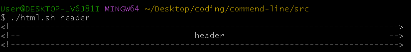

# headers

Bash scripts that create formatted header comments

<br>

## 🎯 Requirements

- [Visual Studio Code](https://code.visualstudio.com/download): A code editor (or any compiler of your choice).
- [Git](https://git-scm.com/downloads): A recommended terminal for non-Linux users. 

<br>

## ✨ Usage

> Generate custom headers with a simple command!
> ```bash
> {file-name} {header-text}
> ```
> - Replace `{file-name}` with the file’s path and name.
> - Replace `{header-text}` with your desired title.

<br>

## 📝 Sample

**Programming Language: HTML, XML, XSLT, SGML, VBScript, md, JSP**



```bash
<!------------------------------------------------------------------------------>
<!--                                   header                                 -->
<!------------------------------------------------------------------------------>
```

<br>

**Programming Language: C/C++, CSS, Java, JavaScript, Solidity, Rust, C#, Swift, PHP, GO**


```bash
    /*//////////////////////////////////////////////////////////////
                                 header
    //////////////////////////////////////////////////////////////*/
```

<br>

**Programming Language: Bash, Python, Ruby, Perl, R**


```bash
# ################################################################ #
#                              header                              #
# ################################################################ #
```

<br>

**Programming Language: SQL-based database languages**


```bash
------------------------------------------------------------------------------
--                                   header                                 --
------------------------------------------------------------------------------
```

<br>
<br>

inspired by [transmission11](https://github.com/transmissions11/headers)